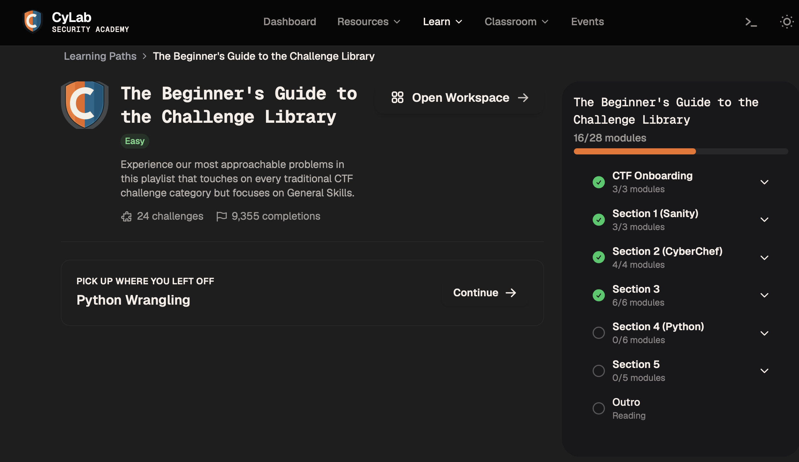
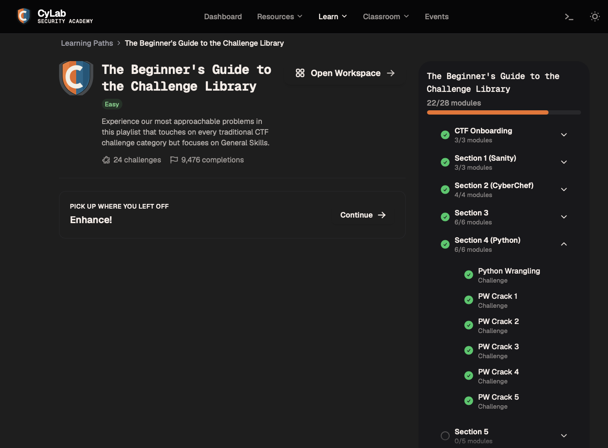
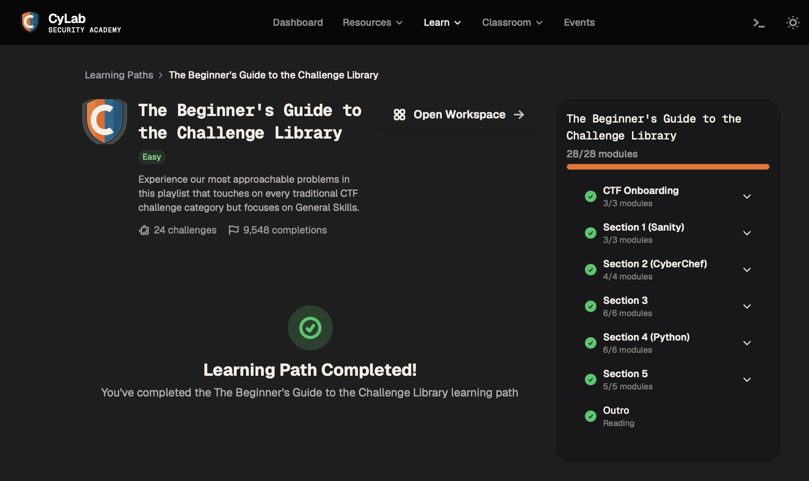

# CyLab — picoCTF Progress Tracker

Personal repo for tracking my progress through picoCTF challenges, organized by category. Each category folder has its own README with stats, a challenge log, and notes.

## Overall Stats

| Metric | Value |
|---|---|
| Challenges solved | 0 |
| Total points | 0 |
| Categories started | 0 / 6 |

## Categories

| Category | Solved | Points | Link |
|---|---|---|---|
| General Skills | 0 | 0 | [General-Skills/](General-Skills/README.md) |
| Cryptography | 0 | 0 | [Cryptography/](Cryptography/README.md) |
| Web Exploitation | 0 | 0 | [Web-Exploitation/](Web-Exploitation/README.md) |
| Forensics | 0 | 0 | [Forensics/](Forensics/README.md) |
| Binary Exploitation | 0 | 0 | [Binary-Exploitation/](Binary-Exploitation/README.md) |
| Reverse Engineering | 0 | 0 | [Reverse-Engineering/](Reverse-Engineering/README.md) |

## Progress Log

